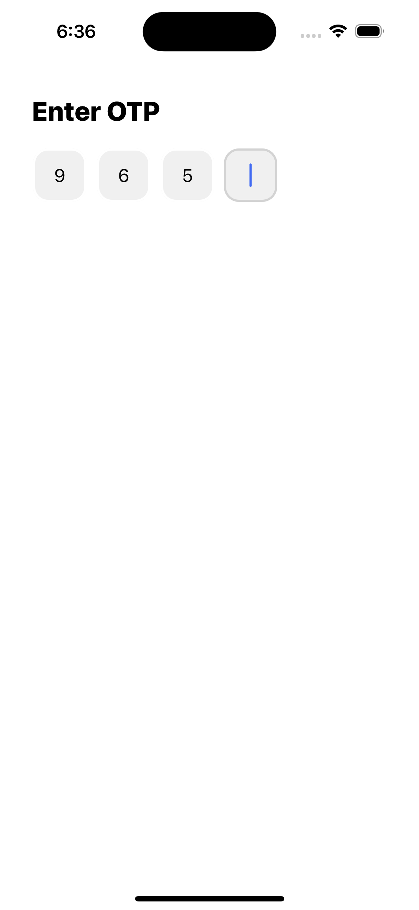
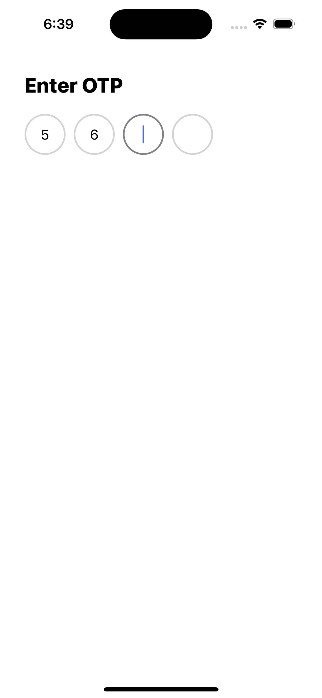
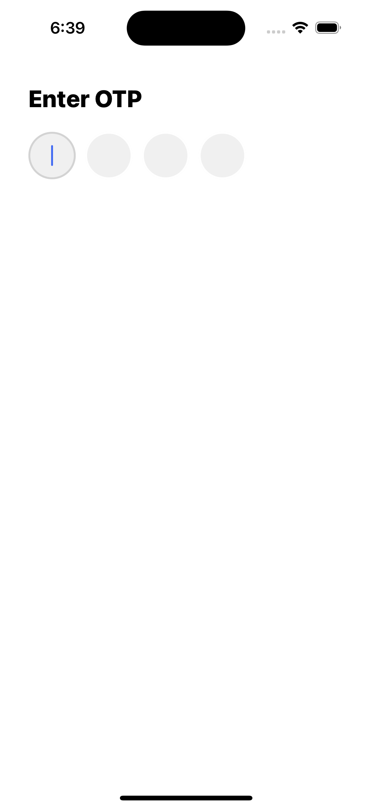
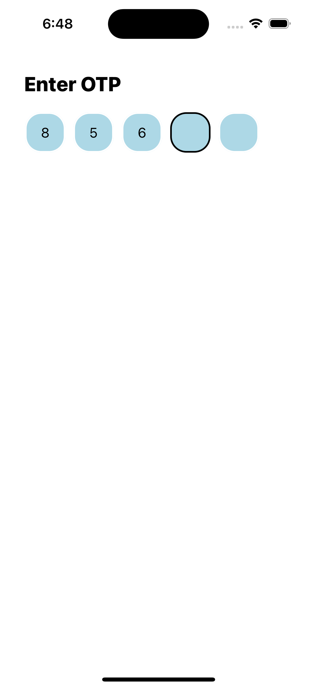

# @coderscotch/rn-otp-input

React Native OTP Input is a flexible and customizable OTP input component for React Native applications.

## Installation

Install the package using npm:

```bash
npm i @harsh_coder/rn-otp-input
```

## Screen Shots

Customize based on your requrements


|  |      |      |
| ---------------------------------- | -------------------------------------- | -------------------------------------- |
|  |

## Usage

```jsx
import React from "react";
import { OtpInput } from "@harsh_coder/rn-otp-input";

function App(): React.JSX.Element {
  return (
    <OtpInput
      otpLength={4}
      inputBoxStyles={{
        backgroundColor: "#f0f0f0",
        borderRadius: 14,
        fontSize: 17,
        color: "black",
        width: 50,
        height: 50,
      }}
      gap={10}
      activeBorderColor={"lightgrey"}
      borderColor={"white"}
      borderWidth={2}
      placeholder={""}
      keyboardType="number-pad"
      onChange={(otp) => {
        // Use user entered otp here
      }}
      autoFocus
    />
  );
}

export default App;
```

## Props

